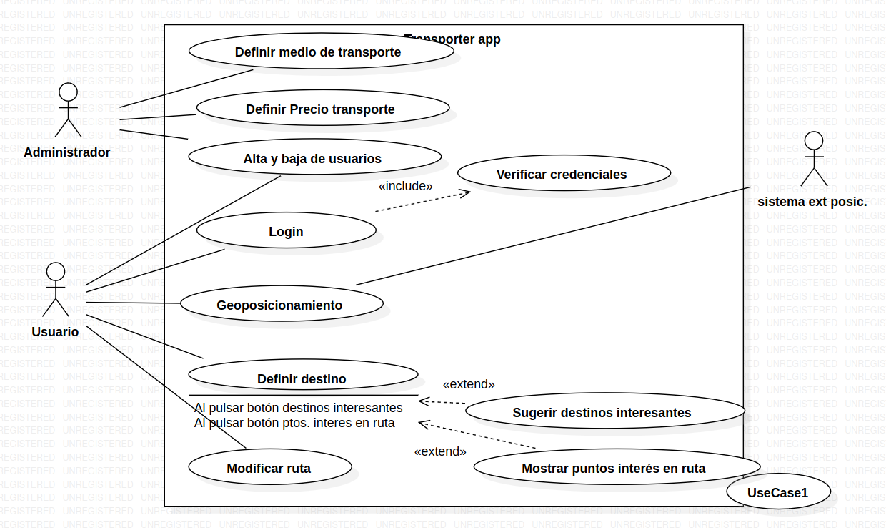

# Aplicación de transporte -  Especificación de Casos de Uso

De acuerdo al siguiente diagrama, se debe realizar tablas de los casos de uso:

## Actor

| Actor | Administrador |
|---|---|
| Descripción | El administrador es la persona encargada de utilizar privilegios para gestionar la aplicación del diagrama de casos de uso y controlar el sistema relacionado con los medios de transporte. |
| Características | Presenta la capacidad de gestionar usuarios, acceso a funciones administrativas y habilidad para definir y manejar la información contenida en la aplicación. |
| Relaciones | Mantiene relaciones con otros actores como Usuarios durante la alta y baja de usuarios. |
| Referencias | Realiza acciones relacionadas con la administración del sistema y la aplicación del diagrama de casos de uso, como "Definir Medio de Transporte", "Definir precio del transporte", y "Gestionar bajada y subida de Usuarios".
| Notas | El administrador puede ser una persona designada con conocimientos técnicos o un rol dentro de la organización encargada de la gestión del sistema de transporte. |
| Autor | Kai Rodríguez García |
| Fecha | 20/01/2024 |

## Caso de uso

| Caso de Uso  | Definir Medio de Transporte |
|---|---|
| Fuentes | Documento de requisitos del sistema, *App Transport* |
| Actor | Administrador |
| Descripción | Permite al administrador establecer un nuevo medio de transporte en el sistema, detallando sus características y parámetros.  |
| Flujo básico | Primero el administrador inicia sesión en el sistema. Navega hacia la sección de "Definir Medio de Transporte". Ingresa la información correspondiente al nuevo medio de transporte (nombre, tipo, capacidad, etc.).  Confirma la adición del nuevo medio de transporte. La toma de entrada incluye la elección del administrador, y el medio de transporte se define según dicha entrada. |
| Pre-condiciones | Se requiere que el administrador haya iniciado sesión en el sistema. |
| Post-condiciones | Una vez completado el proceso, el nuevo medio de transporte queda registrado en el sistema y está disponible para su utilización. Además, el medio de transporte estará debidamente definido en el sistema después de la toma de entrada y el ajuste según la elección del administrador. |
| Requerimientos | Acceso a la función de administración de medios de transporte (no se proporciona información específica en la segunda tabla). |
| Notas | Caso de uso eimprescindible para mantener actualizado el sistema de medios de transporte. |
| Autor | Kai Rodríguez |
| Fecha | 20/01/2024 |

