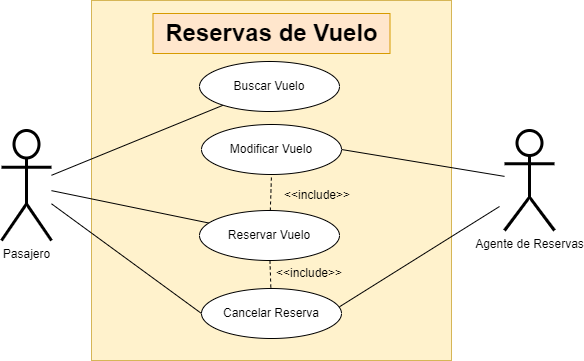

# Gestión de Reservas de Vuelo

Creación de un diagrama de casos de uso para un sistema de reservas de vuelos. Los actores pueden ser "Pasajero" y "Agente de Reservas". Algunos casos de uso podrían ser "Buscar Vuelo", "Reservar Vuelo", "Cancelar Reserva", etc.

## Actores
|  Actor | Pasajero |
|---|---|
| Descripción  | Usuario utiliza el sistema de reservas de vuelos para buscar, reservar y gestionar vuelos. |
| Características  | Busca vuelos según fechas, precios, descuentos especiales etc. Puedes realizar reservas y cancelar las mismas |
| Relaciones | Mediante un agente puede modificar  la reserva o cancelarla |
| Referencias | Buscar Vuelo, Reservar Vuelo, Cancelar Reserva |
| Notas | Preferencias de tipo de equipaje y de asiento, y puede tener necesidades especiales. |
| Autor | Kai Rodríguez García |
| Fecha | 20/01/2024 |

|  Actor | Agente de Reservas |
|---|---|
| Descripción  | Persona que trabaja en el sistema de reservas de vuelos que tiene capacidad para cancelar vuelos y modificar reservas en el sistema. |
| Características  | Acceso a la base de datos de las reservas, y gestión de estas con los datos de los pasajeros. Puede también cancelar reservas. |
| Relaciones | Con el pasajero, al gestionar las reservas |
| Referencias | Gestión de reservas, Cancelar Reserva |
| Notas | Acceso y permiso de edición en el sistema de reservas |
| Autor | Kai Rodríguez García |
| Fecha | 20/01/2024 |

### Casos de Uso

|  Caso de Uso | Buscar Vuelo  |
|---|---|
| Fuentes  | Sistema de reservas de vuelos |
| Actor  | Pasajero  |
| Descripción | El cliente puede buscar vuelos disponibles según diferentes criterios.  |
| Flujo básico | El usuario accede a la sección de búsqueda de vuelos. Ingresa criterios como fecha, destino, etc. Obtiene resultados de búsqueda |
| Pre-condiciones | Ninguna información al respecto |
| Post-condiciones  | El usuario puede ver una lista de vuelos que coinciden con los criterios de búsqueda.  |
| Requerimientos | Conexión a Internet para acceder a la base de datos de vuelos.  |
| Notas | Se puede optar por distintas tarifas de precio según residente o familia numerosa. |
| Autor | Kai Rodríguez García |
| Fecha | 20/01/2024 |

|  Caso de Uso | Reservar Vuelo  |
|---|---|
| Fuentes  | Sistema de reservas de vuelos |
| Actor  | Pasajero  |
| Descripción | Permite al pasajero reservar un vuelo encontrado en la búsqueda.  |
| Flujo básico | El usuario selecciona un vuelo y rellena con sus datos necesarios los campos requeridos.  Confirma la reserva. |
| Pre-condiciones | El usuario ha encontrado un vuelo que quiere reservar. |
| Post-condiciones  | El sistema registra la reserva asociada al pasajero.  |
| Requerimientos | Disponibilidad del vuelo e información del pasajero.  |
| Notas | Se puede proporcionar la opción de elegir asientos, seguro de viaje y opciones de equipaje. |
| Autor | Kai Rodríguez García |
| Fecha | 20/01/2024 |

|  Caso de Uso | Gestionar Reservas  |
|---|---|
| Fuentes  | Sistema de reservas de vuelos |
| Actor  | Agente de Reservas  |
| Descripción | Reservas buscar y gestionar reservas en nombre de los pasajeros.  |
| Flujo básico | Entra a la base de datos de reservas.  Busca y selecciona la reserva deseada. Realiza acciones como modificar detalles o verificar el estado de la reserva. |
| Pre-condiciones | Permisos de edición de reserva |
| Post-condiciones  | Actualización de la reserva de acuerdo a los cambios del agente.  |
| Requerimientos | Conexión a Internet para acceder a la base de datos de reservas.  |
| Notas | Se tiene en cuenta si a la reserva le corresponde o no de ser modificada | 
| Autor | Kai Rodríguez García |
| Fecha | 20/01/2024 |

|  Caso de Uso	CU | Cancelar Reservas  |
|---|---|
| Fuentes  | Sistema de reservas de vuelos |
| Actor  | Agente de Reservas, Pasajero  |
| Descripción | Permite al agente de reservas o al pasajero cancelar una reserva existente.  |
| Flujo básico |  Acceso al apartado de gestión de reservas. Seleccionar y conformar la cancelación de la reserva. |
| Pre-condiciones | Existencia previa de una reserva en el sistema. |
| Post-condiciones  | La reserva se marca como cancelada en el sistema.  |
| Requerimientos | Permiso de cancelación autorizado |
| Notas | Existen políticas de cancelación y cargos o reembolso. |
| Autor | Kai Rodríguez García |
| Fecha | 20/01/2024 |
