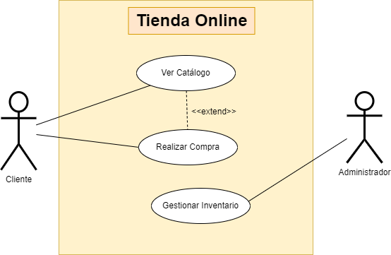

## Tienda en Línea

Creación de un diagrama de casos de uso para un sistema de gestión de tienda en línea. Los actores pueden ser "Cliente" y "Administrador". Casos de uso incluyen "Ver Catálogo", "Realizar Compra", "Gestionar Inventario", etc.

## Actores

| Actor | Cliente  |
|---|---|
| Descripción  | Usuario accede a la tienda en línea para buscar productos y realizar compras. |
| Características  | Puede ver el catálogo de productos y realizar compras. Tiene una lista de compra y datos de pago |
| Relaciones | No tiene relación con el administrador |
| Referencias | Ver Catálogo y Realizar Compra |
| Notas | Puede una configuración en la cuenta y un historial de compras. |
| Autor | Kai Rodríguez García |
| Fecha | 20/01/2024 |

| Actor | Administrador  |
|---|---|
| Descripción  | Persona encargada de la gestión y administración del sistema de la tienda en línea. |
| Características  | Tiene permiso para modificar el catálogo de productos. Acceso a los datos de clientes y pedidos. |
| Relaciones | No tiene relación con el cliente. |
| Referencias | Gestionar Inventario |
| Notas | También podría encargarse de gestionar pedidos y ver la información de los clientes |
| Autor | Kai Rodríguez García |
| Fecha | 20/01/2024 |

## Casos de Uso

| Caso de Uso | Ver Catálogo  |
|---|---|
| Fuentes  | Sistema de gestión de tienda en línea |
| Actor  | Cliente  |
| Descripción |Permite al cliente ver los productos disponibles de la tienda que puedan  interesarle. |
| Flujo básico | El cliente accede a la sección de catálogo. Busca productos utilizando filtros y categorías, reciviendo un resultado, pudiendo ver las características y precio de cada uno.  |
| Pre-condiciones | El cliente ha entrado a la web de la tienda. |
| Post-condiciones  | El cliente puede ver información de los productos y opción de comprarlo.  |
| Requerimientos | Conexión a Internet  |
| Notas | Variados filtros de búsqueda: colores, tipo de producto, precio etc. |
| Autor | Kai Rodríguez García |
| Fecha | 20/01/2024 |

| Caso de Uso | Realizar Compra  |
|---|---|
| Fuentes  | Sistema de gestión de tienda en línea |
| Actor  | Cliente  |
| Descripción | Permite al cliente elegir y comprar los productos que quiere comprar del catálogo. |
| Flujo básico |El cliente selecciona productos para comprar y va a la "cesta". Rellena con sus datos los campos de métofo de pago y dirección de envío. Confirma y completa la compra. |
| Pre-condiciones | Debe haber seleccionado productos para comprar. |
| Post-condiciones  | Compra registrada. Se inicia su proceso para comprobar el pago y ser enviado  |
| Requerimientos | Información de pago y dirección de envío del cliente.  |
| Notas | Opciones para aplicar cupones o descuentos. |
| Autor |  Kai Rodríguez García |
| Fecha | 20/01/2024 |

| Caso de Uso | Gestionar Inventario  |
|---|---|
| Fuentes  | Sistema de gestión de tienda en línea |
| Actor  | Administrador  |
| Descripción | Administrador tiene permiso de gestionar el inventario de productos de la tienda en línea.  |
| Flujo básico | 1. El administrador accede a la sección de gestión de inventario y puede agregar, modificar o eliminar información de productos o productos. |
| Pre-condiciones | El administrador tiene los permisos concedidos para realizar modificaciones. |
| Post-condiciones  | El inventario se actualiza según los cambios del administrador.  |
| Requerimientos | Acceso a la base de datos del sistema de la tienda.  |
| Notas | Puede cambiar precios como ofertas estacionales, o actualizar cantidades disponibles |
| Autor | Kai Rodríguez García |
| Fecha | 20/01/2024 |
