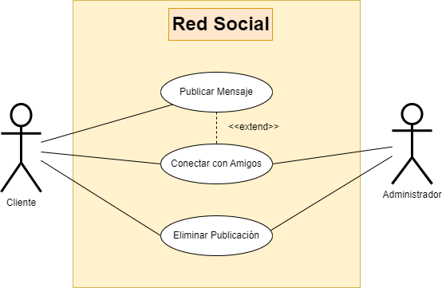

# Aplicación de Red Social

Creación de un diagrama de casos de uso para una aplicación de red social. Los actores pueden ser "Usuario" y "Administrador". Casos de uso incluyen "Publicar Mensaje", "Conectar con Amigos", "Eliminar Publicación", etc.

## Actores

| Actor  | Cliente  |
|---|---|
| Descripción  | Persona registrada en la aplicación de red social.   |
| Características  | Puede interactuar en la plataforma para interactuar con otros usuarios y compartir mensajes.  |
| Relaciones  | Ambos pueden relacionarce entre sí en una interacción en la red social  |
| Referencias  | Publica Mensaje, conecta con amigos, elimina publicación. |
| Notas  | Puede tener elementos en su perfil como número de amigos, publicaciones con me gusta, guaradados o favoritos.  |
| Autor | Kai Rodríguez García |
| Fecha | 21/01/2024 |

| Actor  | Administrador  |
|---|---|
| Descripción  | Usuario con privilegios especiales encargado de gestionar y moderar la plataforma de la red social. |
| Características  | Puede moderar y modificarel contenido, y tener permiso de ver los aspectos técnicos del sistema de la red social. |
| Relaciones  | Puede interactuar con el usuario y con sus publicaciones |
| Referencias  | Modera el contenido, eliminando las publicaciones que no cumplan con las normas. |
| Notas  | Acceso a funciones y datos confidenciales. |
| Autor | Kai Rodríguez García |
| Fecha | 21/01/2024 |

## Caso de Uso

| Caso de Uso | Publicar Mensaje  |
|---|---|
| Fuentes  | Aplicacion de Red Social  |
| Actor  | Usuario  |
| Descripción  | Escribir mensajes de texto y compartirlo, pudiendo verlo sus amigos. |
| Flujo Básico  | Inicia la aplicación, va a la sección de escribir publicación, escribe su mensaje, inserta alguna imagen si quiere, y pulsa el botón de enviar. |
| Pre-condiciones  | Iniciar sesión en la app. |
| Post-condiciones  | Se publica el mensaje y puede ser visto por otros usuarios. |
| Requerimientos  | Conexión a Internet. |
| Notas  | Puede configurar opciones de privacidad de la publicación y atiquetar amigos|
| Autor | Kai Rodríguez García |
| Fecha | 21/01/2024 |

| Caso de Uso   | Conectar con Amigos  |
|---|---|
| Fuentes  | Aplicacion de Red Social  |
| Actor  | Usuario  |
| Descripción  | Permite al usuario añadir amigos y enviarles mensajes privados. |
| Flujo Básico  | El usuario busca a un amigo mediante su nombre de usuario, envía una solicitud de amistad  y el otro usuario acepta la solicitud. |
| Pre-condiciones  | Ambos usuarios registrados en la aplicación. |
| Post-condiciones  | Se establece contacto y comunicación entre los usuarios. |
| Requerimientos  | Conexión a Internet. |
| Notas  | El usuario que recibe la solicitud puede rechazarla si así lo quiere. |
| Autor | Kai Rodríguez García |
| Fecha | 21/01/2024 |

| Caso de Uso CU    | Eliminar Publicación  |
|---|---|
| Fuentes  | Aplicacion de Red Social  |
| Actor  | Administrador, Usuario |
| Descripción  | Permite al administrador eliminar publicaciones de usuarios que infringen las normas de la plataforma. También permite al usuario borrar un mensaje suyo cuando quiera si así lo decide. |
| Flujo Básico  |.Se accede a la aplicación, selecciona la publicación que quiere borrar, y pulsa la opción de eliminar. |
| Pre-condiciones  | Inicio de sección en la cuenta, y para el administrador, permisos de gestión del contenido de otros usuarios. |
| Post-condiciones  | La publicación seleccionada es eliminada del sistema. |
| Requerimientos  | Conexión a Internet. En caso del administrador, también permisos específicos. |
| Notas  | Las opciones de reportar publicaciones hacen que los administradores decidan eliminar las mismas. |
| Autor | Kai Rodríguez García |
| Fecha | 21/01/2024 |
