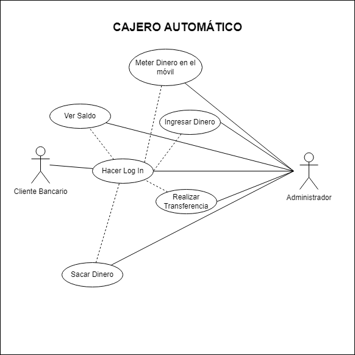
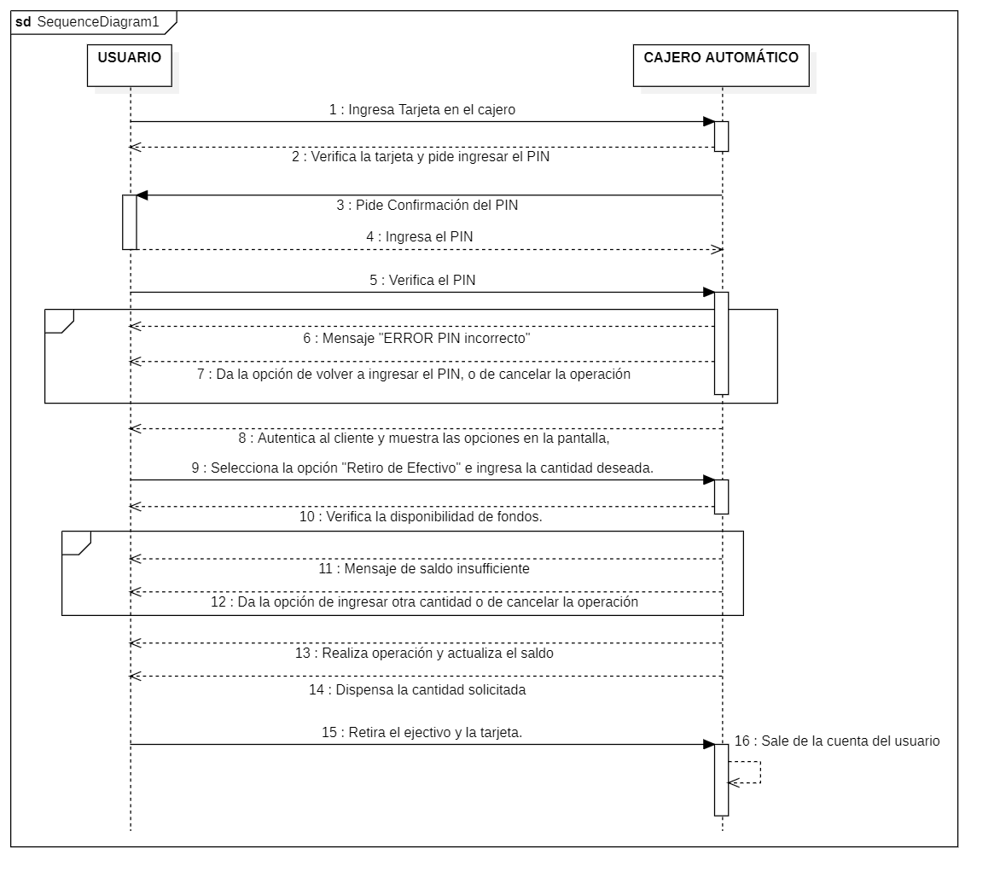

# Cajero Automático. Casos de Uso.

## ACTORES
| Actor           | Sistema Administrativo del Cajero                                                                                                                                                                                   |
| --------------- | ------------------------------------------------------------------------------------------------------------------------------------------------------------------------------------------------------------------- |
| Descripción     | El sistema administrador de banco es una entidad encargada de gestionar la aplicación del diagrama de casos de uso y controlar el sistema relacionado con las operaciones bancarias.                                |
| Características | Posee la capacidad de gestionar cajeros automáticos, acceder a funciones administrativas y habilidad para definir y manejar la información contenida en la aplicación bancaria específica para cajeros automáticos. |
| Relaciones      | Mantiene relaciones con el Cliente bancario al interactuar y realizar operaciones, y mantiene relación con el sistema bancario general y la base de datos.                                                          |
| Referencias     | Realiza acciones relacionadas con la administración del sistema de cajeros automáticos como gestionar transacciones con los clientes.                                                                               |
| Notas           | Es una entidad de software dentro del sistema bancario, encargada de la gestión automatizada de los cajeros automáticos. No se trata de una persona física en este caso.                                            |
| Autor           | Kai Rodríguez García                                                                                                                                                                                                |
| Fecha           | 10/02/2024                                                                                                                                                                                                          |

| Actor           | Cliente Bancario                                                                                                                                                            |
| --------------- | --------------------------------------------------------------------------------------------------------------------------------------------------------------------------- |
| Descripción     | El cliente bancario es un usuario que utiliza los servicios proporcionados por el sistema bancario, como realizar transacciones, consultar saldos y gestionar su cuenta.    |
| Características | Tiene la capacidad de realizar operaciones bancarias, como retiros, depósitos, transferencias y consultar saldos.                                                           |
| Relaciones      | Mantiene relaciones con el Sistema Bancario para realizar operaciones y gestionar su cuenta.                                                                                |
| Referencias     | Realiza acciones relacionadas con la utilización de servicios bancarios, como "Realizar Transferencia", "Consultar Saldo", "Poner dinero en el móvil" o "Ingresar Dinero" . |
| Notas           | El cliente bancario es un usuario registrado en el sistema bancario y puede interactuar con los servicios a través de cajeros automáticos o aplicaciones móviles/online.    |
| Autor           | Kai Rodríguez García                                                                                                                                                        |
| Fecha           | 10/02/2024                                                                                                                                                                  |

## Casos de Uso

### Hacer Log In

| Caso de Uso CU-04 | Hacer Login                                                                                                                                                                                      |
| ----------------- | ------------------------------------------------------------------------------------------------------------------------------------------------------------------------------------------------ |
| Actor             | Cliente Bancario                                                                                                                                                                                 |
| Descripción       | El cliente debe ser autenticado en la cuenta bancaria con su tarjeta y contraseña.                                                                                                               |
| Flujo básico      | <table><tr><th>Paso</th><th>Acción</th></tr><tr><td>1</td><td>El cliente ingresa la tarjeta.</td></tr><tr><td>2</td><td>Ingresa la contraseña.</td></tr></table>                                 |
| Flujo alternativo | <table><tr><th>Paso</th><th>Acción</th></tr><tr><td>1</td><td>En caso de que la contraseña ingresada sea incorrecta...</td></tr><tr><td></td><td>A.1 Se cierra el caso de uso.</td></tr></table> |
| Pre-condiciones   | El cliente debe estar registrado con una cuenta bancaria.                                                                                                                                        |
| Post-condiciones  | El cliente ingresa al menú de opciones disponibles para realizar en el cajero.                                                                                                                   |
| Requerimientos    | N/A                                                                                                                                                                                              |
| Autor             | Kai Rodríguez García                                                                                                                                                                             |
| Fecha             | 10/02/2024                                                                                                                                                                                       |

### Realizar Transferencia

| Caso de Uso       | Realizar Transferencia                                                                                                                                                                                                                                                                                                                                                                                          |
| ----------------- | --------------------------------------------------------------------------------------------------------------------------------------------------------------------------------------------------------------------------------------------------------------------------------------------------------------------------------------------------------------------------------------------------------------- |
| Actor             | Cliente Bancario                                                                                                                                                                                                                                                                                                                                                                                                |
| Descripción       | El cliente realiza una transferencia de fondos a otra cuenta, ya sea interna o externa al banco.                                                                                                                                                                                                                                                                                                                |
| Flujo básico      | <table><tr><th>Paso</th><th>Acción</th></tr><tr><td>1</td><td>El cliente selecciona la opción "Realizar Transferencia" en el menú.</td></tr><tr><td>2</td><td>Ingresa los detalles de la cuenta de destino (número de cuenta, nombre del beneficiario).</td></tr><tr><td>3</td><td>Especifica la cantidad a transferir.</td></tr><tr><td>4</td><td>Confirma la transacción con su contraseña.</td></tr></table> |
| Flujo alternativo | <table><tr><th>Paso</th><th>Acción</th></tr><tr><td>1</td><td>Si la cuenta de destino no existe...</td></tr><tr><td></td><td>A.1 Se muestra un mensaje de error y se cierra el caso de uso.</td></tr><tr><td>2</td><td>Si la cantidad supera el límite diario de transferencia...</td></tr><tr><td></td><td>A.1 Se muestra un mensaje de error y se cierra el caso de uso.</td></tr></table>                    |
| Pre-condiciones   | El cliente debe haber iniciado sesión en su cuenta bancaria.                                                                                                                                                                                                                                                                                                                                                    |
| Post-condiciones  | Se realiza la transferencia de fondos y se actualiza el saldo de ambas cuentas.                                                                                                                                                                                                                                                                                                                                 |
| Requerimientos    | La cuenta de destino puede ser interna o externa al banco, y se deben cumplir las políticas de seguridad establecidas por el banco.                                                                                                                                                                                                                                                                             |
| Autor             | Kai Rodríguez García                                                                                                                                                                                                                                                                                                                                                                                            |
| Fecha             | 10/02/2024                                                                                                                                                                                                                                                                                                                                                                                                      |

### Ver saldo

| Caso de Uso       | Ver Saldo                                                                                                                                                                                                           |
| ----------------- | ------------------------------------------------------------------------------------------------------------------------------------------------------------------------------------------------------------------- |
| Actor             | Cliente Bancario                                                                                                                                                                                                    |
| Descripción       | El cliente verifica el saldo disponible en su cuenta bancaria.                                                                                                                                                      |
| Flujo básico      | <table><tr><th>Paso</th><th>Acción</th></tr><tr><td>1</td><td>El cliente selecciona la opción "Ver Saldo" en el menú.</td></tr><tr><td>2</td><td>El sistema muestra el saldo actual de la cuenta.</td></tr></table> |
| Flujo alternativo | N/A                                                                                                                                                                                                                 |
| Pre-condiciones   | El cliente debe haber iniciado sesión en su cuenta bancaria.                                                                                                                                                        |
| Post-condiciones  | El cliente visualiza el saldo de su cuenta.                                                                                                                                                                         |
| Requerimientos    | N/A                                                                                                                                                                                                                 |
| Autor             | Kai Rodríguez García                                                                                                                                                                                                |
| Fecha             | 10/02/2024                                                                                                                                                                                                          |

### Ingresar Dinero

| Caso de Uso       | Ingresar Dinero                                                                                                                                                                                                                                                                             |
| ----------------- | ------------------------------------------------------------------------------------------------------------------------------------------------------------------------------------------------------------------------------------------------------------------------------------------- |
| Actor             | Cliente Bancario                                                                                                                                                                                                                                                                            |
| Descripción       | El cliente deposita dinero en efectivo en su cuenta bancaria a través del cajero automático.                                                                                                                                                                                                |
| Flujo básico      | <table><tr><th>Paso</th><th>Acción</th></tr><tr><td>1</td><td>El cliente selecciona la opción "Ingresar Dinero" en el menú.</td></tr><tr><td>2</td><td>Ingresa la cantidad de dinero a depositar.</td></tr><tr><td>3</td><td>Introduce el dinero en el cajero automático.</td></tr></table> |
| Flujo alternativo | N/A                                                                                                                                                                                                                                                                                         |
| Pre-condiciones   | El cliente debe haber iniciado sesión en su cuenta bancaria.                                                                                                                                                                                                                                |
| Post-condiciones  | Se deposita el dinero en la cuenta del cliente y se actualiza el saldo.                                                                                                                                                                                                                     |
| Requerimientos    | El cajero automático debe aceptar depósitos en efectivo.                                                                                                                                                                                                                                    |
| Autor             | Kai Rodríguez García                                                                                                                                                                                                                                                                        |
| Fecha             | 10/02/2024                                                                                                                                                                                                                                                                                  |

### Sacar Dinero

| Caso de Uso       | Sacar Dinero                                                                                                                                                                                                                                                                                                                                             |
| ----------------- | -------------------------------------------------------------------------------------------------------------------------------------------------------------------------------------------------------------------------------------------------------------------------------------------------------------------------------------------------------- |
| Actor             | Cliente Bancario                                                                                                                                                                                                                                                                                                                                         |
| Descripción       | El cliente retira dinero en efectivo de su cuenta bancaria a través del cajero automático.                                                                                                                                                                                                                                                               |
| Flujo básico      | <table><tr><th>Paso</th><th>Acción</th></tr><tr><td>1</td><td>El cliente selecciona la opción "Sacar Dinero" en el menú.</td></tr><tr><td>2</td><td>Ingresa la cantidad de dinero a retirar.</td></tr><tr><td>3</td><td>Confirma la transacción con su contraseña.</td></tr><tr><td>4</td><td>El cajero dispensa el dinero solicitado.</td></tr></table> |
| Flujo alternativo | <table><tr><th>Paso</th><th>Acción</th></tr><tr><td>1</td><td>Si el monto solicitado supera el límite diario de retiro...</td></tr><tr><td></td><td>A.1 Se muestra un mensaje de error y se cierra el caso de uso.</td></tr></table>                                                                                                                     |
| Pre-condiciones   | El cliente debe haber iniciado sesión en su cuenta bancaria.                                                                                                                                                                                                                                                                                             |
| Post-condiciones  | Se retira el dinero de la cuenta del cliente y se actualiza el saldo.                                                                                                                                                                                                                                                                                    |
| Requerimientos    | El cajero automático debe contar con suficiente efectivo y el cliente debe tener saldo suficiente.                                                                                                                                                                                                                                                       |
| Autor             | Kai Rodríguez García                                                                                                                                                                                                                                                                                                                                     |
| Fecha             | 10/02/2024                                                                                                                                                                                                                                                                                                                                               |

### Meter dinero en el móvil

| Caso de Uso       | Meter Dinero en el Móvil                                                                                                                                                                                                                                                                                               |
| ----------------- | ---------------------------------------------------------------------------------------------------------------------------------------------------------------------------------------------------------------------------------------------------------------------------------------------------------------------- |
| Actor             | Cliente Bancario                                                                                                                                                                                                                                                                                                       |
| Descripción       | El cliente carga dinero en su aplicación móvil asociada a la cuenta bancaria.                                                                                                                                                                                                                                          |
| Flujo básico      | <table><tr><th>Paso</th><th>Acción</th></tr><tr><td>1</td><td>El cliente selecciona la opción "Meter Dinero en el Móvil" en el menú.</td></tr><tr><td>2</td><td>Ingresa la cantidad de dinero a añadir en la aplicación móvil.</td></tr><tr><td>3</td><td>Confirma la transacción con su contraseña.</td></tr></table> |
| Flujo alternativo | <table><tr><th>Paso</th><th>Acción</th></tr><tr><td>1</td><td>Si la aplicación móvil no está vinculada...</td></tr><tr><td></td><td>A.1 Se muestra un mensaje de error y se cierra el caso de uso.</td></tr></table>                                                                                                   |
| Pre-condiciones   | El cliente debe haber iniciado sesión en su cuenta bancaria y tener la aplicación móvil vinculada.                                                                                                                                                                                                                     |
| Post-condiciones  | Se carga el dinero en la aplicación móvil asociada y se refleja en la cuenta del cliente.                                                                                                                                                                                                                              |
| Requerimientos    | La aplicación móvil debe estar vinculada a la cuenta bancaria y ser compatible con la función de cargar dinero.                                                                                                                                                                                                        |
| Autor             | Kai Rodríguez García                                                                                                                                                                                                                                                                                                   |
| Fecha             | 10/02/2024                                                                                                                                                                                                                                                                                                             |

## Diagrama de Secuencia

